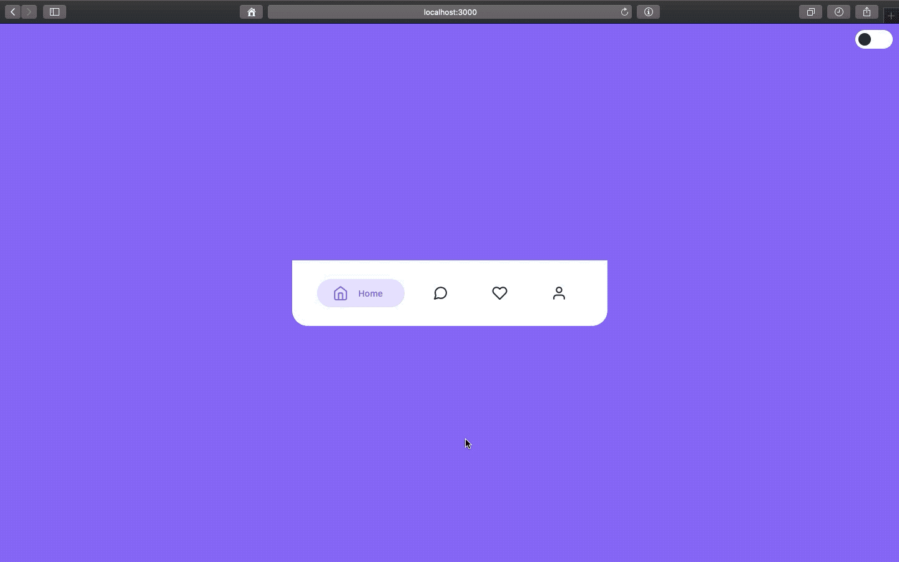

<h1 align="center">React Tab Bar</h1>

<p align="center">
  
</p>


## How to use

To clone and run this application, you'll need [Git](https://git-scm.com/downloads) and [React](https://reactjs.org/docs/getting-started.html) installed on your computer. From your command line:

```
# Clone this repository
$ git clone https://github.com/feMoraes0/react-tab-bar.git

# Go into the repository
$ cd react-tab-bar

# Install dependencies
$ npm install

# Run the app
$ npm start
```

## Credits
 - [Navigation Pattern - Tab Bar Animation by Santosh Kushanwar](https://dribbble.com/shots/11139339-Navigation-Pattern-Tab-Bar-Animation)

## Contact
  - <a target="_blank" href="https://www.linkedin.com/in/fernando-moraes-48a26916a/">LinkedIn</a>
  - <a target="_blank" href="mailto:fernandomoraes.lopes@gmail.com">E-mail</a>